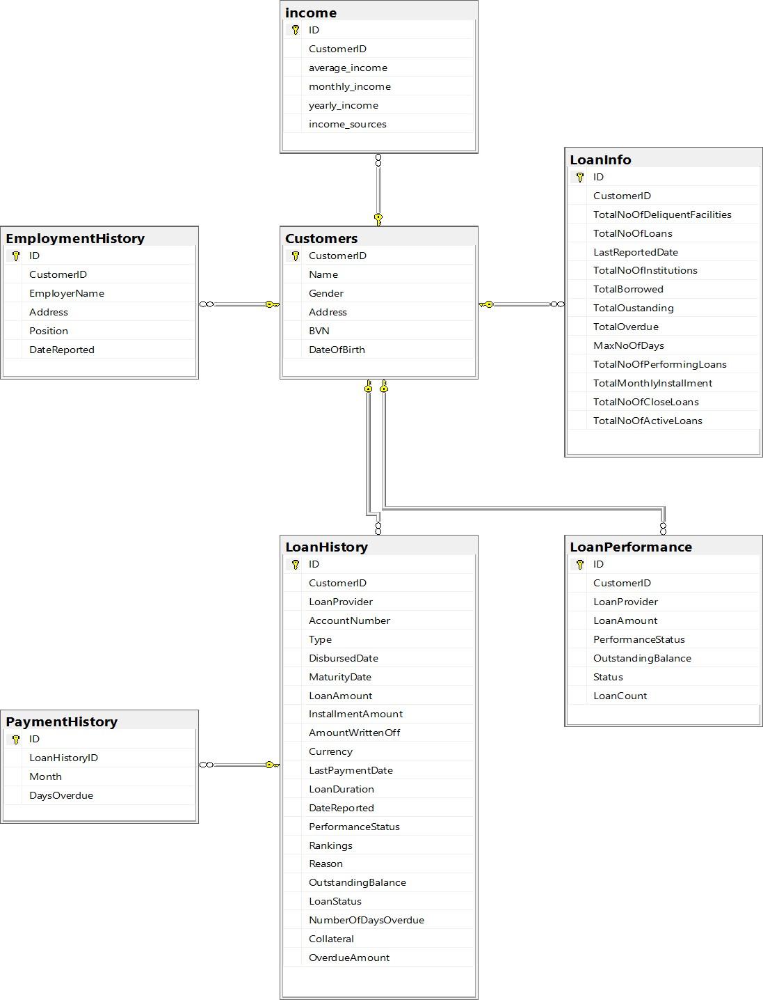

# Credit Decision Model

## Introduction
The Credit Decision Engine is designed to assess the probability of default for loan customers by analyzing their financial behavior and credit history using SQL-based algorithms. This system enables lenders to make informed decisions by predicting the risk associated with each loan application, thereby optimizing loan approvals and minimizing defaults.

## Technology Used
1. Scripting Language - SQL

## Data Model

